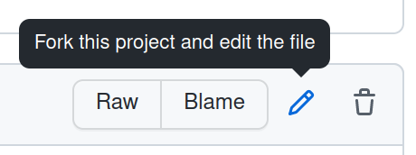
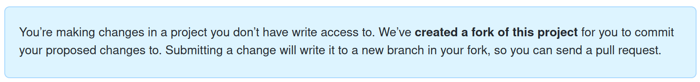
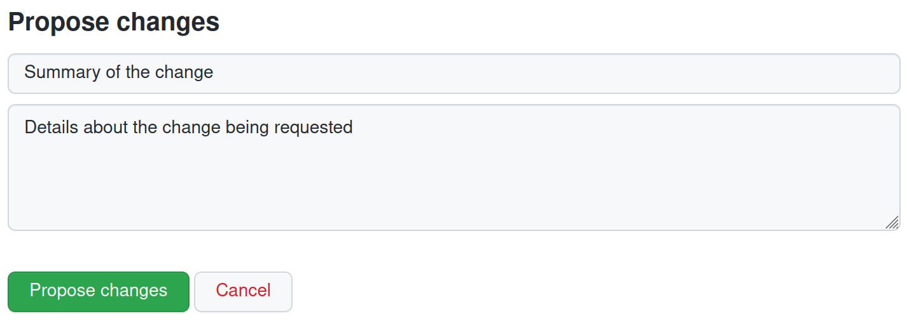
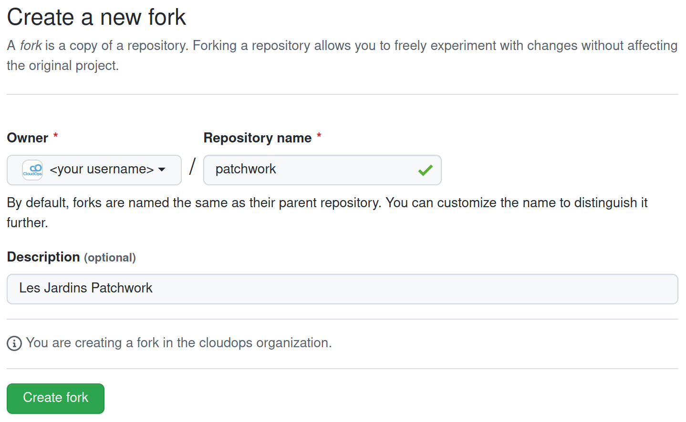
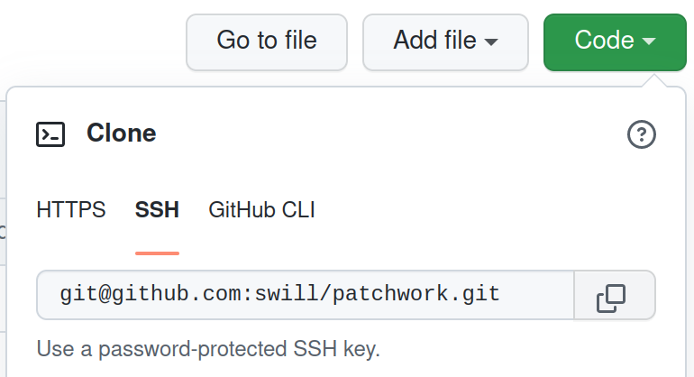

# Contributing

There are two recommended ways to contribute to the website.  In both cases, you will need an account on [Github](https://github.com/).

## As an Editor (the simple way)

1. In your browser, navigate to a piece of content that you want to edit within the Github repo.
   For example: `https://github.com/swill/patchwork/tree/main/content/homepage/<section>.fr.md`
2. Click the **Pencil** icon in the top left of the page.

   
3. On the **edit page**, you will be presented with a message to notify you that a **fork** of the repository will be added to your Github account.

   
4. Edit the content on the page as desired using [Markdown](https://www.markdownguide.org/basic-syntax/) syntax.
5. Make sure both the `en` and `fr` content has been updated with the change (steps 1 - 4).
6. Once all changes have been made, add a summary and a description of the changes you are proposing, and click the `Propose changes` button at the bottom of the page.

   
7. You will be walked through a wizard to create a Pull Request from your fork against the official repository.
8. The board / admins will review the changes, and merge the Pull Request once approved.
9.  When the Pull Request is merged into `main`, a Github Action will automatically publish the change to the public website.

## As a Developer (the comprehensive way)

Working with this repository as a developer is a little bit more involved, but is not overly complicated for anyone who has worked with `git` and Github before.

### Install Hugo

The website is developed with a tool called [Hugo](https://gohugo.io/), which is a static site generator written in Golang.  I would recommend you install Hugo locally by following the [Hugo installation instructions](https://gohugo.io/getting-started/installing/).  With Hugo installed locally, you will be able to view the changes you make locally before you make a pull request.

Once you have installed Hugo, you will have access to the `hugo` command line tool.

```bash
# for details on how to use hugo, check the the cli help with the following command
$ hugo --help
```

Now that you have Hugo, we can get the code and start interacting with it.

### Install Git

[Git](https://git-scm.com/) is a source code versioning system, and it is the foundation of working with Github.

You will need to [download and install git](https://git-scm.com/downloads) in order to work with this repository.

### Install a code editor

If you will be making changes to the code on your local computer, you will need a text editor.

I recommend using [VScode](https://code.visualstudio.com/), as it is easy to use, does not take much resources, and requires little to no setup.

[Download and install VScode](https://code.visualstudio.com/Download) in order to have the `code` command line, which launches the desktop editor.

### Fork the code

It is recommended that you create a **fork** of the official repository and make your changes on your fork, and then create a **pull request** to contribute your changes back to the official repository.

1. In your browser, navigate to: [github.com/swill/patchwork](https://github.com/swill/patchwork)
2. Click on the `Fork` button in the top right of the page.
3. Choose where you want to fork to, and then click the `Create fork` button.

   
4. Within your fork, click on the `Code` button and copy the provided URL.  In my case, I am using SSH so I am not prompted for my username and password every time I interact with `git`.

   
5. Now that you have the URL, we are going to do a `git clone` to pull the code to your local computer.

   ```bash
   # in my case, I would run the following command somewhere on my computer where I want the code to live
   $ git clone git@github.com:swill/patchwork.git

   # cd into the patchwork code directory
   $ cd patchwork

   # pull in the hugo theme via the tracked submodule
   $ git submodule update --init --recursive
   ```
6. You now have the source code and theme dependencies in the `patchwork` folder on your computer.

### Run the website locally

You can run the website locally by simply running the following `hugo` command.

```bash
$ hugo serve
```
```
Start building sites …
hugo v0.99.1-d524067382e60ce2a2248c3133a1b3af206b6ef1+extended linux/amd64 BuildDate=2022-05-18T11:18:14Z VendorInfo=gohugoio

                   | FR  | EN
-------------------+-----+------
  Pages            |   7 |   7
  Paginator pages  |   0 |   0
  Non-page files   |   0 |   0
  Static files     | 164 | 164
  Processed images |   0 |   0
  Aliases          |   1 |   0
  Sitemaps         |   2 |   1
  Cleaned          |   0 |   0

Built in 68 ms
Watching for changes in /dropbox/Dropbox/code/patchwork/{archetypes,content,data,layouts,static,themes}
Watching for config changes in /dropbox/Dropbox/code/patchwork/config.toml
Environment: "development"
Serving pages from memory
Running in Fast Render Mode. For full rebuilds on change: hugo server --disableFastRender
Web Server is available at http://localhost:1313/patchwork/ (bind address 127.0.0.1)
Press Ctrl+C to stop
```

Now the website is now being served on your local machine, so navigate to it in your browser: [http://localhost:1313/patchwork/](http://localhost:1313/patchwork/)

Now you can make content changes locally, and see what the changes look like in your browser before you make a pull request.

### Making code changes

The following sequence of events is how you will usually make changes to the website and then push them to your fork.

```bash
# cd into the patchwork code directory
$ cd patchwork

# open the code in an editor ('code' in my case) so you can modify the code
$ code .

# in the editor, make changes to the content
# likely files in the 'content/homepage' directory

# in this case, I am assuming you are just committing into the 'main' branch, but you could choose to make changes on a different branch instead
$ git checkout main

# once you have made changes, you can check what file were changed according to git
$ git status

# you can also review the actual changes you have made
$ git diff

# once you are happy with the changes, you will want to add them to be tracked by git
$ git add .

# we now need to commit the changes so they can be tracked by git
# we need to specify a commit message with the commit
$ git commit -m "commit message for the change"

# now you are all set to push your changes to your fork
$ git push
```

### Pulling in upstream changes

When multiple people are managing content on the site, there will be a number of different forks which will be contributing changes to the official repository.

In this case, I will refer to the official repository as the `upstream` repository, and will use a remote name of `upstream` when referencing it.

In order to pull in upstream changes, we need to add a `git remote` to our local git repository.

In this case, we will assume that [github.com/swill/patchwork](https://github.com/swill/patchwork) is the upstream repository.

In your browser, navigate to [github.com/swill/patchwork](https://github.com/swill/patchwork) and click on the `Code` button to copy the clone URL.


Then on your local computer do the following:

```bash
# cd into the patchwork code directory
cd patchwork

# check and make sure you don't have any uncommitted edits.
$ git status

# if you have uncommitted edits, commit them now using the 'Making code changes' instructions

# we will checkout the 'main' branch
$ git checkout main

# we will now add the remote and call it 'upstream'
$ git remote add upstream git@github.com:swill/patchwork.git

# fetch the changes from 'upstream'
$ git fetch upstream

# pull in the upstream changes for this branch with the '--rebase' flag
$ git pull upstream main --rebase

# rebase will first attempt to apply the upstream changes to your repo, and then make the changes you have made on top of the upstream changes.

# now you can update your fork, which is likely configured as 'origin' and is tracked as your default remote
$ git push

# or if 'origin' is not your default remote, but is the fork you want to target
$ git push origin main
```

## Development Resources

The following references will likely come in handy when working with this site.

- [Hugo Docs](https://gohugo.io/documentation/) - Hugo is the static site generator which the site is built with.
- ['hugo-scroll' Hugo Theme](https://github.com/janraasch/hugo-scroll/) - The Hugo theme we are using is called `hugo-scroll`, with some slight modifications.
- [Markdown Syntax](https://www.markdownguide.org/basic-syntax/) - The vast majority of the content will be managed with Markdown, so you will likely use this reference (or another of the many online) for a bit until you get used to the syntax.
- [Git Cheatsheet](http://git-cheatsheet.com/) - Git can be very simple to use, but it is very powerful, so a lot can be done with it.  I would recommend just sticking to the basic commands outline above until you get comfortable with the `git` command line.